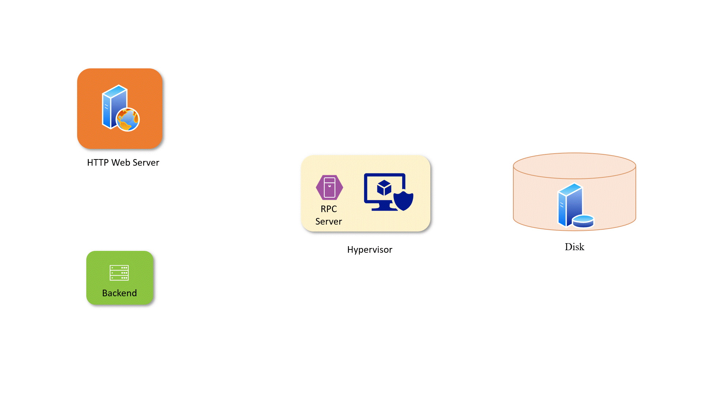
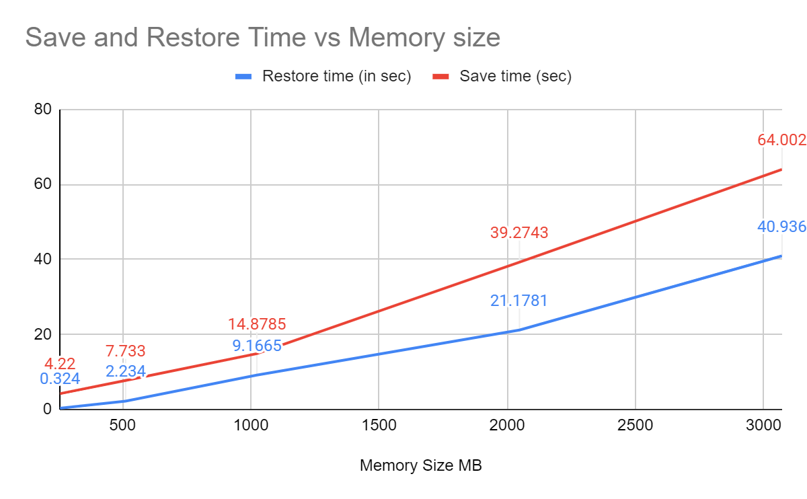

<div align="center">
 <!-- #readme-top -->
 
 <a name="readme-top"></a>
<h1 align="center">Live Snapshot and Restore</h1>
  <p align="center">
    A KVM based service to save snapshot of a running VM and restore VM from saved snapshot
    <br />
    <!-- <a href="https://github.com/github_username/repo_name"><strong>Explore the docs »</strong></a> -->
    <!-- <br />
    <br />
    <a href="https://github.com/github_username/repo_name">View Demo</a>
    · -->
    <a href="https://github.com/anirudhakulkarni/Live-Snapshot/issues">Report Bug</a>
    
  </p>
</div>


<!-- TABLE OF CONTENTS -->
<details>
  <summary>Table of Contents</summary>
  <ol>
    <li>
      <a href="#about-the-project">About The Project</a>
    </li>
    <li>
      <a href="#getting-started">Getting Started</a>
      <ul>
        <li><a href="#prerequisites">Prerequisites</a></li>
        <li><a href="#installation">Installation</a></li>
      </ul>
    </li>
    <li><a href="#usage">Usage</a></li>
    <li><a href="#usage">Result</a></li>
    <li><a href="#license">License</a></li>
  </ol>
</details>


<!-- ABOUT THE PROJECT -->
## About The Project

<!-- crates.io badge -->

The project is built on the [vmm-refernce](https://github.com/codenet/vmm-reference) codebase that serve as a starting point in the creation of tailor-made VMMs that users build according to their needs. But it does not provide the functionality to pause and resume a VM. That is motivation for our project.
We take dependencies from our [webserver](https://github.com/chintansheth1711/col732_project_webserver) part for communication with the backend and from our [deduplication](https://github.com/anirudhakulkarni/de-duplication) part for storing snapshots efficiently. 
Here are the 3 basic functionalities provided:- 

1. ### Starting an VM

Let's the user to start a VM from an raw bzimage saved in the disk. Here's the complete workflow:-




2. ### Saving the snapshot

Let's the user to take snapshot of a running VM and save the snapshot to disk. VM that is paused can further be exited or resumed depending on the user's request. Here's the complete workflow:-


2. ### Restoring VM from snapshot

Let's the user to run a VM from an already saved snapshot. Here's the complete workflow:-


<p align="right">(<a href="#readme-top">back to top</a>)</p>

We also provide the functionality to bypass the need of backend for testing purposes. The user can directly provide the port and bzimage/snapshot path to run the VM directly

<!-- GETTING STARTED -->
## Getting Started

The library is made entirely in rust. You need to install rust to use this library and packages mentioned in the `Cargo.toml` file.
### Prerequisites

Install rust from [here](https://www.rust-lang.org/tools/install)

### Installation

1. Clone the repo
   ```sh
   git clone https://github.com/anirudhakulkarni/Live-Snapshot
   ```
2. Install Rust packages
   ```sh
    cargo build
    ```

<p align="right">(<a href="#readme-top">back to top</a>)</p>


<!-- USAGE EXAMPLES -->
## Usage

Execute the following command to run the VM:- 

```bash
vmm-reference                     
    --kernel path=/path/to/vmlinux
    --port <port_no>
    [--memory_path <memory_snapshot_path>]
    [--cpu_path <cpu_snapshot_path>]
    [--block <blkdev_config>]
    [--net <netdev_config>]
    [--memory <guest_memory_size>]
    [--vcpu <no_of_vcpus>]
```

The default configuration can be updated through the command line.

The crate's [`Cargo.toml`](Cargo.toml) controls which VMM functionalities are
available. By default, all rust-vmm crates are listed as dependencies and
therefore included. Users can play freely with the building blocks by modifying
the TOML, and the prepackaged CLI can quickly validate the altered
configurations. Advanced users can, of course, plug in their own front-end.

Example usage:

1. ### Running from bzimage

```rust
cargo run -- --kernel path=bzimage_final8 --port 10010  

```

2. ### Running from snapshot

```rust
cargo run -- --kernel path=bzimage_final8 --port 10010 --cpu_path cpu.txt --memory_path mem.txt
```


<p align="right">(<a href="#readme-top">back to top</a>)</p>


## Demo
We demonstrate ability to pause and resume a Linux VM (focal fossa) running on a KVM hypervisor. We start a VM from a bzimage. We start a python script that prints a progress bar and then take a snapshot of the VM. We then transfer the state of the VM via USB to another machine and resume our snapshot from there. We then exit the VM. The previous commands, disk and output continues as previously. You may find the original video [link](https://youtu.be/Hi0ueb6cBV4)


## Results

On i79750-H processor with 8GB RAM here are the benchmarks for a VM having 2 CPUs and 256MB RAM:- 

|  | Average over 100 runs | Standard deviation over 100 runs |
| ------------- | ------------- | ------------- |
| Boot time  | 881.55 ms | 44.507 ms |
| Restore from snapshot  | 300.26 ms  | 57.046 ms |
| Snapshot time  | 2.82 sec  | 0.56sec |


### Save and Restore time 
Upon increasing memory size, time taken to take snapshot and restore time both increases linearly. 





<p align="right">(<a href="#readme-top">back to top</a>)</p>


<!-- LICENSE -->
## License

Distributed under the MIT License. See 
[`LICENSE`](
    LICENSE
) for more information.

<p align="right">(<a href="#readme-top">back to top</a>)</p>


<!-- CONTACT -->
## Contact

Anirudha - [@4n1rudh4](https://twitter.com/4n1rudh4) - kulkarnianirudha8 [at] gmail [dot] com


